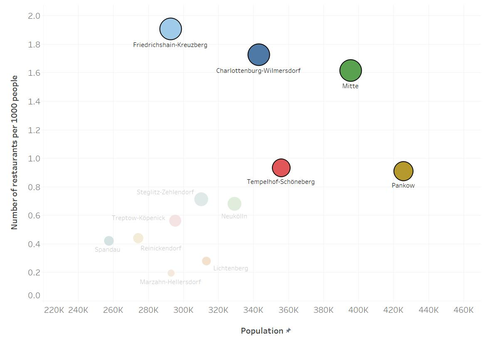
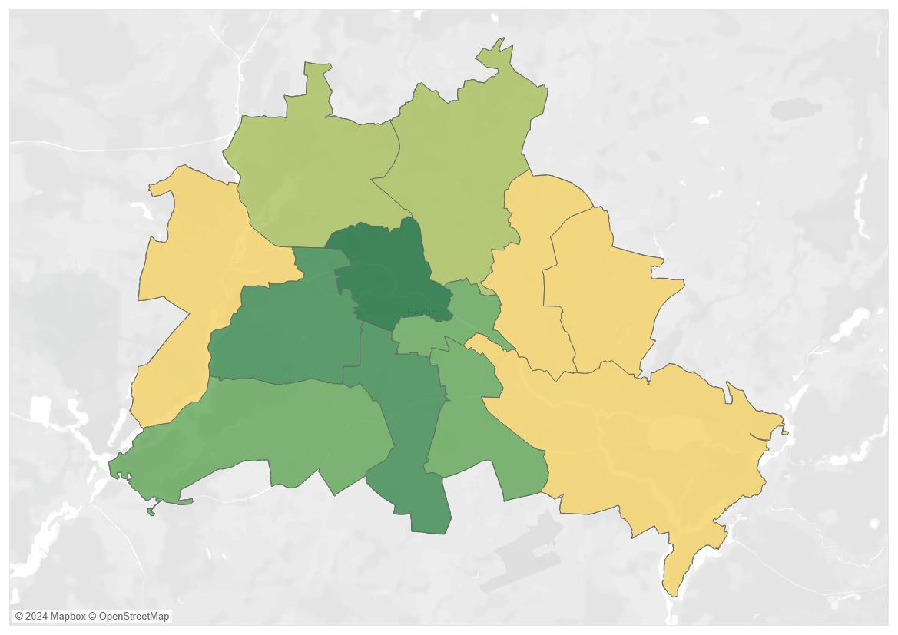
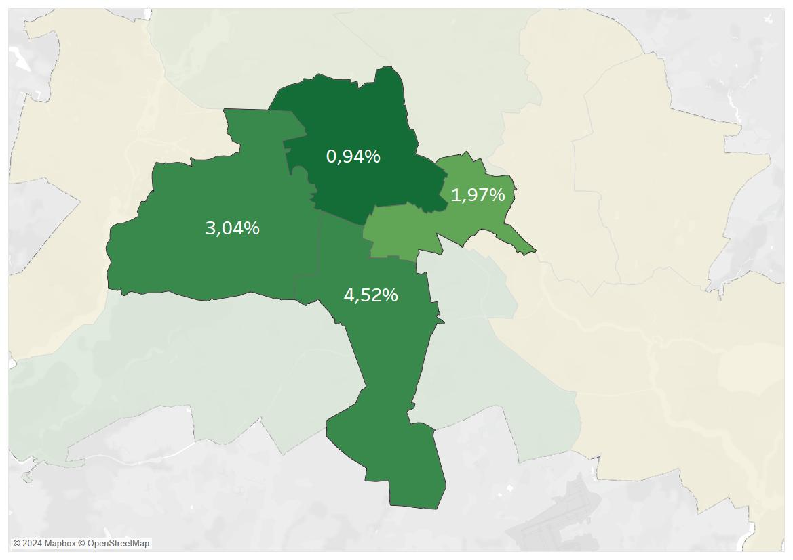

<section data-transition="fade" data-background="assets/background_v2.jpg" data-background-size="cover" data-background-position="center">
    <h3 data-transition="fade-in" style="text-align: center; color: black; font-size: 40px;">BERLIN</h3>
    <h3 data-transition="fade-in" style="text-align: center; color: black; font-size: 50px;">IS</h3>
    <h3 data-transition="fade-in" style="text-align: center; color: black; font-size: 60px;">GROWING</h3>
</section>

<section data-transition="zoom-in fade-out">

</section>

<section data-transition="fade">

</section data-transition="fade">

<section data-transition="fade">

</section>

---

###  

---

### 

<section>

</section>

---

###  

<section>
What Are TOP 3 cuisines  in Berlin?

| #1 | #2 | #3 |
| :---: | :---: | :---: |
|  |  |  |

</section>

---

<section>

</section>

---

### Are Cuisines Where Migrants Are?

---

<section>

</section>

# 

<section data-background="assets/woman.jpg" data-background-size="cover" data-background-position="center">
</section>

<section data-transition="fade">

</section data-transition="fade">

<section data-transition="fade">

</section data-transition="fade">

<section data-transition="fade">

</section data-transition="fade">

<section data-transition="fade">

</section data-transition="fade">

<section data-transition="fade">

</section data-transition="fade">

<section data-transition="slide-in fade-out">

</section>

<section data-transition="fade">

</section data-transition="fade">

---

<section>
| Neighbourhood | Greek Restaurants as % of the Total Number of Restaurants |
| :---: | :---: |
| Tempelhof-Schöneberg | 4.52% |
| Charlottenburg-Wilmersdorf | 3.04% |
| Friedrichshain-Kreuzberg | 1.97% |
| Mitte | 0.94% |
</section>

<section data-transition="fade-in zoom-out">

</section>
---

<section data-transition="fade" data-background="assets/011_heatmap_02.JPG" data-background-size="cover" data-background-position="center">
</section>

<section data-transition="fade" data-background="assets/011_heatmap_03.JPG" data-background-size="cover" data-background-position="center">
</section>

<section data-transition="fade" data-background="assets/011_heatmap_04.JPG" data-background-size="cover" data-background-position="center">
</section>

<section data-background="assets/woman.jpg" data-background-size="cover" data-background-position="center">
</section>

<section data-background="assets/background_v2.jpg" data-background-size="cover" data-background-position="center">
  
  <h2 style="margin-top: 0; color: black; padding-top: 10px; text-align: top;">  ` </h2>

  **Thank You!**

  *Data Sources:*
  
  {style="width: 150px; margin: 20px;"}
  {style="width: 150px; margin: 10px;"}
  {style="width: 150px; margin: 20px;"}

</section>
